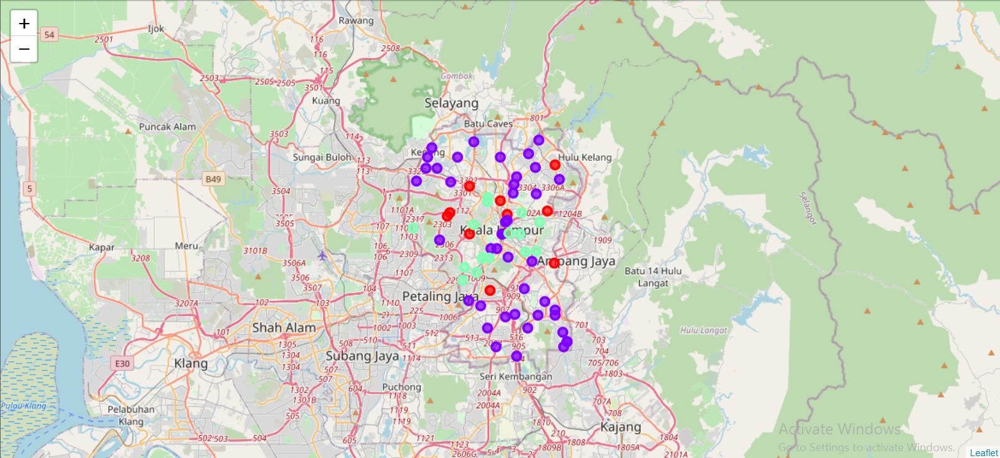

<h1>The Battle of Neighborhood</h1>

<h1>Table of contents</h1>

1. [Introduction](#1) 
2. [Business Problem](#2) 
3. [Target Audience of this project](#3) 
4. [Data Description](#4) 
5. [Methodology](#5) 
6. [Cluster Map](#6) 
7. [Result](#7) 
8. [Discussion](#8) 
9. [Recommendations](#9) 
10. [Conclusion](#10) 

<h2>Introduction</h2>

For many shoppers, visiting shopping malls is a great way to relax and enjoy themselves during weekends and holidays. They can shop grocery and various fashion outlets, dine at restaurants, watch movies and perform many more activities. Shopping malls are like one-stop destination for all types of shoppers. For retailers, the central location and the large crowed at the shopping malls provides a great distribution channel to market their products and services. Property developers are also taking advantage of this trend to build more shopping malls to cater to the demand. As a result, there are many shopping malls in the city of Kuala Lumpur and many more are being built. Opening shopping malls allows property developers to earn consistent rental income. Of course, as with any business decision, opening a new shopping mall requires serious consideration and is a lot more complicated than it seems. Particularly, the location of the shopping mall is one of the most important decisions that will determine whether the mall be a success or a failure.

<h2>Business Problem</h2>

Location of Shopping Mall is one of the most important decision that will determine whether the Mall will be a success or a failure.

<b>Objective : </b>The objective of this capstone project is to analyze and select the best locations in the city of Kuala Lumpur, Malaysia to open new shopping mall.

 
<b>Business Question :</b> In the city of Kuala Lumpur, Malaysia, if a property developer is looking to open a new shopping mall, where would you recommend that they open it ?

<h3>Target Audience of this project</h3>

This project is particularly useful to property developers and investors to open or invest in new shopping malls in the capital city of Malaysia i.e. Kuala Lumpur. This project is timely as the city is currently suffering from oversupply of shopping malls. Data from the National Property Information Center (NPIC) released last year showed that an additional 15 per cent will be added to existing mall space and the agency predicted that total occupancy may dip below 86 per cent. The local newspaper The Malay Mail also reported in March last year that the true occupancy rates in malls may be as low as 40 per cent in some areas, quoting a Financial Times (FT) article cataloging the country's continued obsession with building more shopping space despite chronic oversupply.

<h2>Data Description</h2>
<h4>To solve the problem, we will need the following data : </h4>
<blockquote>
    <ul>
        <li>List of neighborhoods in Kuala Lumpur. This defines the scope of this project which is confined to the city of Kuala Lumpur, the capital city of the country of Malaysia in the South East Asia.</li>
        <li>Latitude and Longitude coordinates of those neighborhoods. This is required in order to plot the map and also to get the venue data.</li>
        <li>Venue data, particularly data related to shopping malls. We will use this data to perform clustering on the neighborhoods.</li>
    </ul>
</blockquote>
<h4>Sources of data</h4>
<blockquote>
    <ul>
        <li>The <a href='https://en.wikipedia.org/wiki/Category:Suburbs_in_Kuala_Lumpur'>
Wikipedia page</a> of neighborhoods (i.e. Federal Territory) of Kuala Lumpur, Malaysia </li>
        <li>Geocoder library for latitude and  longitude coordinates</li>
        <li>Foursquare API for venue data</li>
    </ul>
</blockquote>

<h2>Methodolgy</h2>
<blockquote>
    <ul>
        <li>Web Scrapping Wikipedia page for neighborhoods list using 'Beautifulsoup' library</li>
        <li>Get latitude and longitude coordinates using 'Geocoder' library</li>
        <li>Use Foursquare API to get venue data</li>
        <li>Group data by neighborhood and taking the mean of the frequency of occurrence of each venue category</li>
        <li>Filter venue category by Shopping Mall</li>
        <li>Perform clustering on  the data by using k-means clustering</li>
        <li>Visualize the clusters in a map using Folium</li>
    </ul>
</blockquote>

<h2>Cluster Map</h2>

<h2>Result</h2>
Categorized the neighborhoods into 3 clusters :
<blockquote>
    <ul>
        <li><b>Cluster 0 :</b> Neighborhoods with moderate number of shopping malls</li>
        <li><b>Cluster 1 :</b> Neighborhoods with low number to no existence of shopping malls</li>
        <li><b>Cluster 2 :</b> Neighborhoods with high concentration of shopping malls</li>
    </ul>
</blockquote>

<h2>Discussion</h2>
<ul>
    <li>Most of the shopping malls are concentrated in the central area of the city</li>   
    <li>Highest number  in cluster 2 and moderate number in cluster 0</li>    
    <li>Cluster 1 has very low number to no shopping mall in the neighborhoods</li>   
    <li>Oversupply of shopping malls mostly happened in central area of the city, with the suburb area still have very few shopping malls</li>
</ul>

<h2>Recommendations</h2>
<blockquote>
    <ul>
        <li>Open new Shopping Malls in neighborhoods in cluster 1 with little to no competition</li>
        <li>Can also open in neighborhoods in cluster 0 with moderate competition if have unique selling propositions to stand out from the competition</li>
        <li>Avoid neighborhoods in cluster 2, already high concentration of shopping malls and intense competition</li>
    </ul>
</blockquote>

<h2>Conclusion</h2>
<blockquote>
    <ul>
        <li>Answer to business question : The neighborhoods in cluster 1 are the most preferred locations to open a new Shopping Mall</li>
        <li>Findings of this project will help the relevant stakeholders to capitalize on the opportunities  on high potential locations while avoiding overcrowded areas in their decisions to open a new Shopping Mall.</li>
    </ul>
</blockquote>
